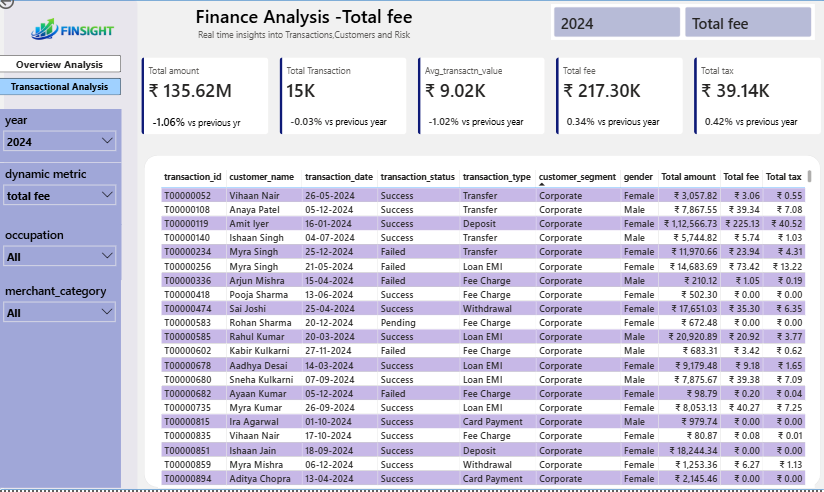

# FinSight – Financial Transaction Analytics Dashboard

## 📊 Project Overview

FinSight is an interactive financial analytics dashboard developed using Microsoft Power BI.

The project analyzes financial transactions, transaction values, fees, taxes, customer segments, transaction status, and time-based performance. The dashboard transforms financial transaction data into interactive and actionable business insights using DAX measures and Power BI visualizations.

---

## 🎯 Project Objectives

The main objectives of this project are to:

- Analyze overall financial transaction performance
- Monitor total transaction amount and transaction volume
- Track average transaction value
- Analyze total fees and taxes
- Understand transaction trends over time
- Compare financial performance across customer segments
- Analyze successful, failed, and pending transactions
- Measure year-over-year performance
- Provide an interactive dashboard for business decision-making

---

## 🛠️ Tools & Technologies

- **Microsoft Power BI**
- **DAX**
- **Data Modeling**
- **Data Visualization**
- **Time Intelligence**
- **Financial Analytics**

---

## 📌 Dashboard Pages

### 1. Overview Analysis

The Overview Analysis page provides a high-level summary of the financial performance.

#### Key KPIs

- Total Amount
- Total Transactions
- Average Transaction Value
- Total Fee
- Total Tax

#### Key Analysis

- Year-wise financial performance
- Year-over-year growth
- Monthly transaction trends
- Fee trends over time
- Customer segment analysis
- Transaction status analysis

---

### 2. Transactional Analysis

The Transactional Analysis page focuses on detailed transaction-level performance and comparison.

The page allows users to analyze financial metrics using interactive filters and compare:

- Transaction volume
- Transaction amount
- Average transaction value
- Fees
- Taxes
- Transaction performance across different periods

---

## 📈 Key DAX Measures

The dashboard uses several DAX measures for financial and time-based analysis, including:

- Total Amount
- Total Transaction
- Average Transaction Value
- Total Fee
- Total Tax
- YoY Growth %
- Transaction Volume Change %
- YoY Average Transaction Value %
- YoY Fee Growth %
- YoY Tax Growth %

Time-intelligence calculations are used to compare current performance with previous-year performance.

---

## 📊 Key Visualizations

The dashboard includes interactive visualizations for:

- Monthly financial trends
- Total Fee by Month
- Total Fee by Customer Segment
- Total Fee by Transaction Status
- Transaction Status analysis
- KPI cards
- Year-based filtering
- Dynamic metric selection

Transaction statuses analyzed include:

- Success
- Failed
- Pending

---

## 💡 Business Insights

The dashboard can help business stakeholders:

- Monitor overall financial performance
- Identify changes in transaction volume
- Track revenue-related metrics
- Understand customer segment contribution
- Monitor transaction success and failure patterns
- Identify monthly trends
- Compare financial performance year over year
- Evaluate fee and tax movements

---

## 🎛️ Interactive Features

The Power BI dashboard includes:

- Year filters
- Dynamic metric selection
- Interactive charts
- KPI cards
- Cross-filtering
- Comparative analysis
- Time-based analysis

These features allow users to explore the financial data dynamically instead of relying on static reports.

---

## 📁 Project Files

The repository contains the Power BI project file:

`Finsight Transactional Analysis project.pbix`

Dashboard screenshots are also included to provide a preview of the report.

---

## 📸 Dashboard Preview

### Overview Analysis

### Transactional Analysis

---

## 🚀 Key Takeaway

FinSight demonstrates how Power BI and DAX can be used to transform financial transaction data into an interactive business intelligence solution.

The dashboard provides stakeholders with a consolidated view of transaction performance, customer segments, fees, taxes, transaction status, and year-over-year trends.

---

## 👩‍💻 Author

**Bhavya kumari**

Aspiring Data Analyst | Power BI | SQL | DAX 
